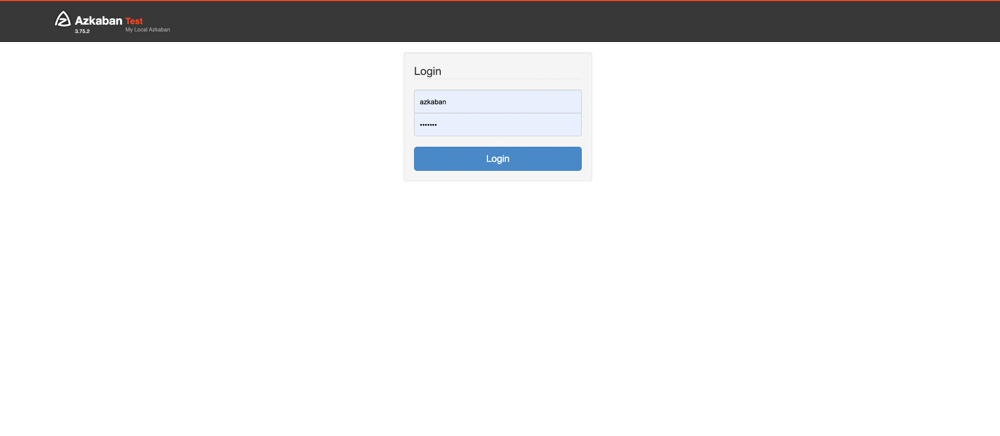
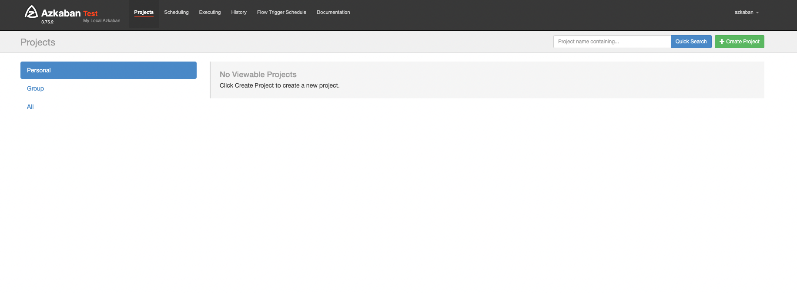

## Docker環境でAzkabanを起動してみる。

### 事前準備
今回は[haxqer](https://github.com/haxqer/azkaban)という方のimageを使用させてもらう。
1. ディレクトリ内にymlファイルなどを配置して、コンテナを起動する。
```
$ git clone https://github.com/haxqer/azkaban.git
$ cd azkaban
$ docker-compose up -d
```
2. Azkabanを起動する
- `http://localhost:8081`　にアクセスする。
- ログインID：azkaban
- パスワード：azkaban



- home画面にログインし、起動成功<br>


以上で環境構築は完了です。

#### 補足
- azkabanのimageファイルはいろいろな人が挙げているので、他のパターンも試してみるといいと思います。
- もちろんDockerを使わずに構築する方法もあります。
  - [Azkaban を使ってジョブの管理・実行をしてみた インストール編](https://tech-lab.sios.jp/archives/13312)
  - ソロサーバー立てる方法で上記は記載されている。
  - 公式ドキュメントには2台サーバーを立てる方法も記載がある。